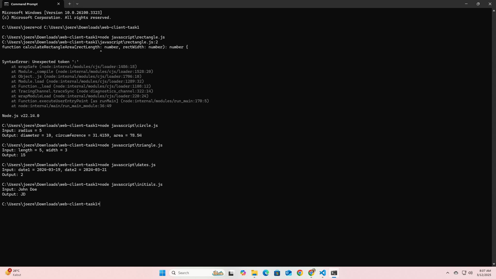
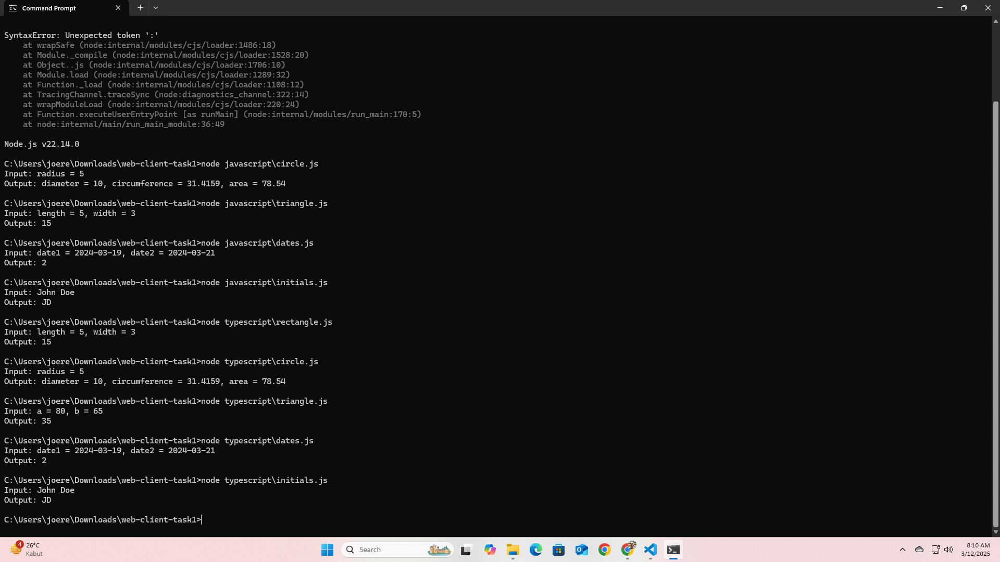

# Perbandingan JavaScript dan TypeScript

## Tentang Proyek
Proyek ini merupakan tugas untuk mata kuliah Web Client Development yang diampu oleh Bapak Dosen Rony Setyawan, S.T., M.Kom. di Universitas Cakrawala. Proyek ini berisi implementasi lima program sederhana yang dibuat dalam dua bahasa pemrograman: JavaScript dan TypeScript.

## Daftar Program
1. **Menghitung Luas Persegi Panjang**
   - Input: length = 5, width = 3
   - Output: 15

2. **Menghitung Diameter, Keliling, dan Luas Lingkaran**
   - Input: radius = 5
   - Output: diameter = 10, circumference = 31.4159, area = 78.539

3. **Mencari Sudut Segitiga jika Dua Sudut Diketahui**
   - Input: a = 80, b = 65
   - Output: 35

4. **Menghitung Selisih Hari Antara Dua Tanggal**
   - Input: date1 = 2024-03-19, date2 = 2024-03-21
   - Output: 2

5. **Mencetak Inisial Nama dalam Huruf Kapital**
   - Input: John Doe
   - Output: JD

## Struktur Folder
- `/javascript` - Berisi implementasi program dalam JavaScript
- `/typescript` - Berisi implementasi program dalam TypeScript
- `/screenshots` - Berisi tangkapan layar hasil eksekusi program

## Cara Menjalankan Program

### JavaScript
1. Pastikan Node.js sudah terinstal
2. Buka terminal/command prompt
3. Navigasi ke direktori proyek
4. Jalankan program dengan perintah:
   ```
   node javascript/rectangle.js
   node javascript/circle.js
   node javascript/triangle.js
   node javascript/dates.js
   node javascript/initials.js
   ```

### TypeScript
1. Pastikan Node.js dan TypeScript sudah terinstal
2. Buka terminal/command prompt
3. Navigasi ke direktori proyek
4. Kompilasi file TypeScript:
   ```
   tsc typescript/rectangle.ts
   tsc typescript/circle.ts
   tsc typescript/triangle.ts
   tsc typescript/dates.ts
   tsc typescript/initials.ts
   ```
5. Jalankan file JavaScript yang dihasilkan:
   ```
   node typescript/rectangle.js
   node typescript/circle.js
   node typescript/triangle.js
   node typescript/dates.js
   node typescript/initials.js
   ```

## Hasil Pengujian

### Hasil JavaScript


### Hasil TypeScript


## Perbandingan JavaScript dan TypeScript

### JavaScript
- Bahasa pemrograman dinamis tanpa deklarasi tipe data
- Lebih fleksibel dan mudah untuk memulai
- Dapat langsung dijalankan tanpa tahap kompilasi
- Rentan terhadap kesalahan tipe data yang hanya terdeteksi saat runtime

### TypeScript
- Superset dari JavaScript dengan fitur static typing
- Menyediakan bantuan autocomplete dan deteksi error yang lebih baik
- Membutuhkan proses kompilasi sebelum dijalankan
- Mendeteksi kesalahan tipe data saat kompilasi sebelum kode dijalankan

## Kesimpulan
Berdasarkan pengalaman mengerjakan program-program sederhana ini, JavaScript lebih mudah dan cepat untuk memulai, sementara TypeScript menawarkan keamanan tipe data yang lebih baik meskipun dengan proses yang lebih kompleks. Pilihan antara keduanya bergantung pada kebutuhan proyek, dengan TypeScript lebih cocok untuk proyek besar yang membutuhkan pemeliharaan jangka panjang.

## Author
Johannes Ronald Elyeser Roparulian Hutagalung, S.H., M.H., M.M., M.Si.

NIM: 24130400002

Universitas Cakrawala
